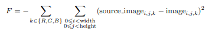

# Image generation using evolutionary algorithms

The pseudocode for the algorithm is as follows:,

Initialize population with <num_inds> individuals each having <num_genes> genes
While not all generations (<num_generations>) are computed:
Evaluate all the individuals
Select individuals
Do crossover on some individuals
Mutate some individuals

**Individuals**

Each individual has one chromosome. Each gene in a chromosome represents one circle to be drawn.
Each gene has at least 7 values:
* The center coordinates, (x, y)
* The radius, radius ∈ Z+
* The color (red, R ∈ Z, green, G ∈ Z, blue, B ∈ Z, alpha, A ∈ R) where (R, G, B) ∈ [0, 255] and
A ∈ [0, 1]

**Evaluation**

In order to evaluate an individual, its corresponding image should be drawn first. Note that the chromosome order is important. The pseudocode is as follows:
Initialize <image> completely white with the same shape as the <source_image>.
For each gene in the chromosome:
overlay <- image
Draw the circle on overlay.
image <- overlay x alpha + image x (1-alpha)
  
The fitness function, F, is:
  

  
**Selection**
 
<num elites> number of best individuals will advance to the next generation directly. The selection of
other individuals is done with tournament selection with size <tm size>.

**Crossover**
  
 <num parents> number of individuals will be used for crossover. The parents are chosen among the best
individuals which do not advance to the next generation directly. Two parents will create two children.
Exchange of each gene is calculated individually with equal probability. The probabilities of child 1
having genei of parent 1 or parent 2 have equal probability, that is 0.5; child 2 gets the gene
from the other parent which is not chosen for child 1, where 0 6 i < <num genes>.
   
**Mutation**
 
The mutation is governed by <mutation prob>. While the generated random number is smaller than
<mutation prob> a random gene is selected to be mutated (same as in N Queen Problem in the lecture
notes). All individuals except the elites are subject to mutation.
There are two ways a gene can be mutated:
* Unguided
– Choose completely random values for x, y, radius, R, G, B, A.
* Guided
– Deviate the x, y, radius, R, G, B, A around their previous values.
∗ x–
width
4 < x0 < x +
width
4
∗ y–
height
4 < y0 < y +
height
4
∗ radius − 10 < radius0 < radius + 10
∗ R − 64 < R0 < R + 64
∗ G − 64 < G0 < G + 64
∗ B − 64 < B0 < B + 64
∗ A − 0.25 < A0 < A + 0.25
– The values should be corrected to a valid one in case they are not.

   
 

  

